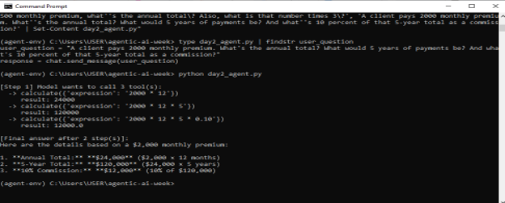
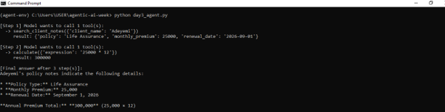
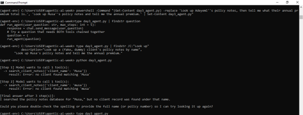

# Agentic AI: 7-Day Learning Sprint — Insurance Client Assistant

## What this is
A self-directed, week-long deep dive into agentic AI — from core concepts to a
working agent — built using Google Gemini's free-tier API. No framework used;
built from raw API calls to understand the underlying mechanics before
relying on abstractions.

## What the final agent does
`agent.py` is an insurance-client assistant agent that combines four core
agentic AI capabilities into one system:

- **Tool use** — can call a calculator and a client-lookup function, deciding
  on its own which tool(s) a question requires and in what order.
- **RAG (Retrieval-Augmented Generation)** — answers policy questions by
  reading `policy_faqs.txt` directly, grounding responses in real reference
  material instead of relying on the model's general knowledge.
- **Long-term memory** — can save facts (e.g. a client's contact preference)
  to `agent_memory.json`, and correctly recalls them in later, completely
  separate runs of the script.
- **Safety guardrails** — a hard step limit prevents runaway loops, and the
  agent is instructed to ask for clarification rather than invent data when
  a lookup fails.

## Day-by-day journey

### Day 1 — Concepts
Studied the distinction between fixed workflows and true agents, and the
ReAct pattern (reason → act → observe → repeat) that underlies most agentic
systems.

### Day 2 — First working agent (tool use)
Built a single-tool calculator agent from the raw Gemini API. Debugged a
model-deprecation error (the API pointed me to the newer model version to
use) and a file-sync issue between my editor and the terminal.

The agent correctly chained three dependent calculations (annual total →
5-year total → 10% commission), firing all three tool calls in a single step
since it recognized they were independent.

### Day 3 — Multiple tools and graceful failure
Added a second tool (client lookup) and watched the model choose between
tools, chain their outputs together, and — critically — handle a failed
lookup honestly instead of fabricating data.

