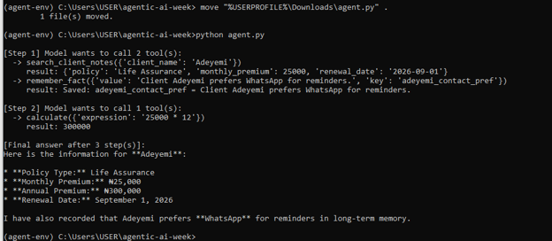

# Agentic AI: 7-Day Learning Sprint — Insurance Client Assistant

## What this is
A self-directed, week-long deep dive into agentic AI — from core concepts to a
working agent — built using Google Gemini's free-tier API. No framework used;
built from raw API calls to understand the underlying mechanics before
relying on abstractions.

## What the final agent does
`agent.py` is an insurance-client assistant agent that combines four core
agentic AI capabilities into one system:

- **Tool use** — can call a calculator and a client-lookup function, deciding
  on its own which tool(s) a question requires and in what order.
- **RAG (Retrieval-Augmented Generation)** — answers policy questions by
  reading `policy_faqs.txt` directly, grounding responses in real reference
  material instead of relying on the model's general knowledge.
- **Long-term memory** — can save facts (e.g. a client's contact preference)
  to `agent_memory.json`, and correctly recalls them in later, completely
  separate runs of the script.
- **Safety guardrails** — a hard step limit prevents runaway loops, and the
  agent is instructed to ask for clarification rather than invent data when
  a lookup fails.

## Day-by-day journey

### Day 1 — Concepts
Studied the distinction between fixed workflows and true agents, and the
ReAct pattern (reason → act → observe → repeat) that underlies most agentic
systems.

### Day 2 — First working agent (tool use)
Built a single-tool calculator agent from the raw Gemini API. Debugged a
model-deprecation error (the API pointed me to the newer model version to
use) and a file-sync issue between my editor and the terminal.


The agent correctly chained three dependent calculations (annual total →
5-year total → 10% commission), firing all three tool calls in a single step
since it recognized they were independent.

### Day 3 — Multiple tools and graceful failure
Added a second tool (client lookup) and watched the model choose between
tools, chain their outputs together, and — critically — handle a failed
lookup honestly instead of fabricating data.


When asked about a client not in the records, the agent retried once with a
different name format, then correctly asked for human clarification rather
than inventing a policy.

### Day 4/5 — RAG and memory
Combined a static knowledge file (RAG) with a persistent memory file that
survives across separate script runs.


A fact saved in one run (a client's contact preference) was correctly
recalled in a completely separate, later run of the script — proof the
memory persisted outside the conversation itself.

### Day 6 — Safety and evaluation
Attempted to force the `max_steps` safety guardrail to trigger using
multiple simultaneous invalid lookups. The agent avoided hitting the limit
by parallelizing independent tool calls and failing gracefully within just
two steps — a useful finding in itself: well-designed tool use can reduce
how often a hard safety limit is actually needed, though the limit remains
valuable as a backstop.

### Day 7 — Shipping the final agent
Combined tool use, RAG, memory, and safety guardrails into one final,
documented agent.



## Notable debugging moments
- **API model deprecation** — a `404` error mid-project when a model version
  became unavailable; fixed by reading the error message and updating the
  model string to the current version.
- **Editor/file-path mismatch** — repeated saves weren't reaching the file
  actually being executed. Diagnosed using `type file | findstr` to verify
  file contents directly from the command line rather than trusting the
  editor, then resolved by editing the file in place via PowerShell.
- **API rate limits** — hit the free tier's daily request quota mid-session,
  a real example of why production agents need to handle API-level failures
  gracefully, not just tool-level ones.

## API key setup (sanitized)


## How to run it
```bash
python -m venv agent-env
agent-env\Scripts\activate      # Windows
pip install google-genai
set GEMINI_API_KEY=your-key-here
python agent.py
```

## Files
- `agent.py` — the final combined agent
- `policy_faqs.txt` — sample knowledge base (dummy data)
- `agent_memory.json` — generated automatically after first run
- `*.png` — screenshots documenting each stage of the build

## Tech
Python, Google Gemini API (`gemini-3.6-flash`), function calling / tool use.
No agent framework used — built directly on the raw API to understand the
mechanics first.
