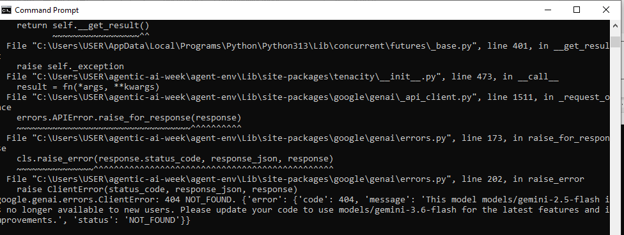
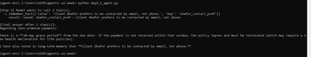
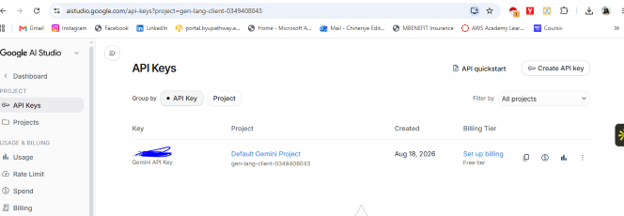

# Agentic AI Assistant Agent

## Technologies
- Google Gemini API (gemini-3.6-flash)
- Python
- Function Calling / Tool Use
- Retrieval-Augmented Generation (RAG)
- JSON-based persistent memory

## Skills Demonstrated
- Agentic system design (tool use, multi-step reasoning loops)
- API integration and debugging
- Retrieval-augmented generation (grounding responses in external data)
- Persistent state management
- Safety guardrail design (loop limits, graceful failure handling)
- Command-line environment troubleshooting

## What I Learned
This project was a self-directed, week-long deep dive into agentic AI,
built from raw API calls rather than a framework, to understand the
underlying mechanics before relying on abstractions. I learned the
distinction between fixed workflows and true agents, and implemented the
ReAct pattern (reason → act → observe → repeat) that underlies most
agentic systems.

Working through this project taught me how agents decide which tools to
call and in what order, how to ground responses in real reference material
using RAG instead of relying on a model's general knowledge, and how to
give an agent persistent memory that survives across separate sessions.
I also learned the importance of safety guardrails — such as step limits
and honest failure handling — after directly observing an agent correctly
decline to fabricate data when a lookup failed, and instead ask for human
clarification.

Real debugging was part of the learning process: I resolved an API
model-deprecation error, an editor/file-path synchronization issue
(diagnosed by verifying file contents directly from the command line
rather than trusting the editor), and a live encounter with API rate
limits — a practical lesson in why production agents need to handle
API-level failures gracefully, not just tool-level ones.

## Project Evidence

**[View the agent code (`agent.py`)](agent.py)**
The final combined agent — tool use, RAG, memory, and safety guardrails
in one system.

**Day 2 — First working agent (tool use)**



**Day 3 — Multiple tools and graceful failure**


**Day 4/5 — RAG and memory**



**Day 7 — Final capstone run**


**API setup (sanitized)**


## How to Run
```bash
python -m venv agent-env
agent-env\Scripts\activate      # Windows
pip install google-genai
set GEMINI_API_KEY=your-key-here
python agent.py
```

## Files
- `agent.py` — the final combined agent
- `policy_faqs.txt` — sample knowledge base (dummy data)
- `agent_memory.json` — generated automatically after first run
