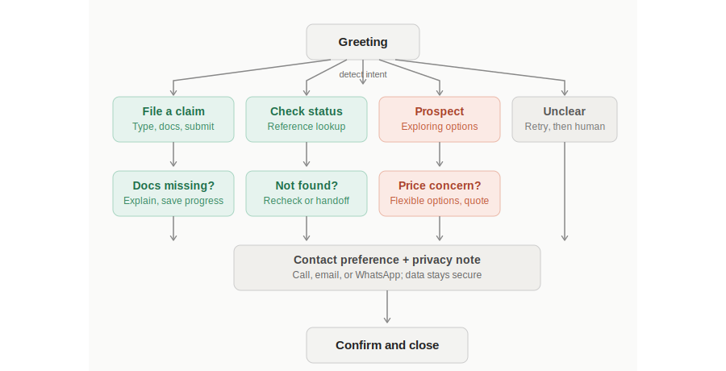
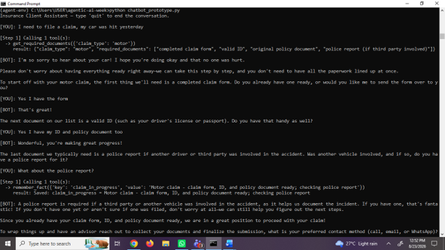
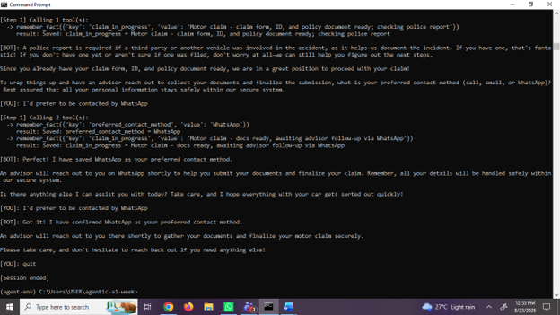

# Insurance Chatbot — Conversation Flow Design

## Technologies
- Conversation/dialogue design
- Flowchart mapping
- UX writing

## Skills Demonstrated
- Conversation flow design (branching dialogue, not linear scripts)
- Scripted dialogue writing with tone and empathy in mind
- Iterative design based on simulated user feedback
- UX thinking for client-facing, trust-sensitive interactions

## What I Learned
This project was a hands-on exercise in designing a conversational flow
for an insurance client chatbot, prompted by a real recruiter conversation
about a ChatGPT Specialist role that called for exactly these skills:
developing and testing conversation scripts, and adjusting dialogue based
on user feedback.

I started by mapping the conversation as a branching flow before writing
any dialogue — covering four real client scenarios: filing a new claim,
checking an existing claim's status, a prospective client still deciding
on coverage, and a fallback path for unclear requests. Every branch
converges on a shared step asking the client's contact preference and
including a brief data-privacy note, so that consistency holds regardless
of how the conversation started.

I then wrote the full scripted dialogue for each branch, and simulated a
round of user feedback to practice the iterative part of the role: testers
found the claims-document question too abrupt for someone who had likely
just been in an accident. I revised the branch to lead with empathy and
break the document checklist into a step-by-step conversation rather than
a yes/no form gate — a change in pacing and tone that only becomes obvious
once you imagine (or observe) a real user going through it, not something
visible from reading a script cold.

## Project Evidence

**Conversation flow diagram**
Maps the full branching structure: greeting → four intent branches → each
branch's key decision point → shared contact-preference/privacy step →
close.

**[Full scripted dialogue](chatbot_dialogue_script.md)**
All four branches written out in full, in a warm, client-appropriate tone.

**[Before/after revision based on feedback](branch1_revision_before_after.md)**
Documents a real design iteration: the original claims-document branch,
the feedback that prompted a change, the revised version, and the
reasoning behind each change.

## Working Prototype

To validate the design, I built a working, interactive version of this
flow using the Google Gemini API (the same approach as the Agentic AI
Assistant project). The entire branching logic and empathetic tone
revisions live in the system prompt, with tools handling the concrete
actions: looking up required documents, checking claim status, and
remembering facts (contact preference, claim progress) across the
conversation.

**[View the prototype code (`chatbot_prototype.py`)](chatbot_prototype.py)**

### Sample run — filing a motor claim

The conversation demonstrates the design goals working as intended: an
empathetic opening rather than jumping straight to a checklist, documents
collected one at a time in natural conversation rather than a form-style
list, intelligent handling of the conditional police-report requirement,
and a proactive save of the client's contact preference to memory —
all without being explicitly instructed to do so at that moment.

## Next Steps
A working prototype of this flow (similar to the agentic AI assistant
project) would be a natural extension — turning the scripted branches
into an actual running conversational agent.
